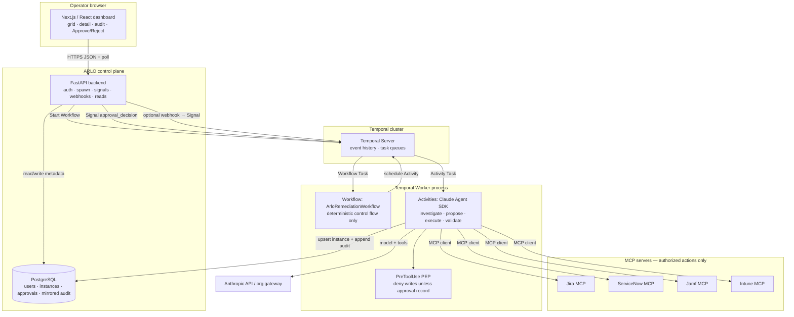
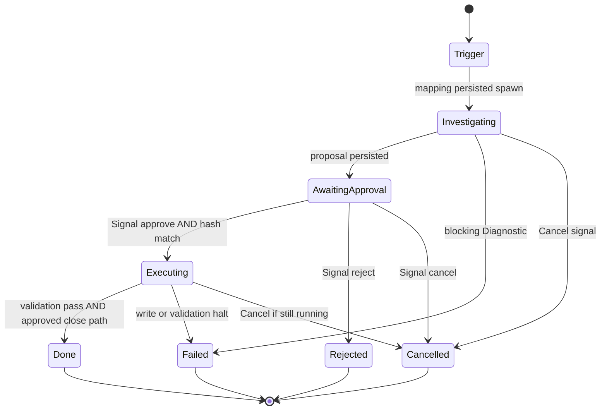

# System Architecture Document: ARLO (Automated Remediation Loop Orchestrator)

**Document type:** AAMAD System Architecture Document (SAD)  
**Product:** ARLO — Automated Remediation Loop Orchestrator  
**Phase:** 1 Define  
**Owner persona:** `@system.arch` (`system-arch`)  
**Date:** 2026-08-31  
**Status:** MVP-authoritative for architecture (product scope from PRD; stack constraints from operator `*create-sad` instruction)  
**Action:** `create-sad --mvp`

## Context & Instructions

This SAD is the Build-phase blueprint for ARLO. Product behavior is taken only from `project-context/1.define/prd.md`. Architectural stack constraints in this document (Temporal.io, Claude Agent SDK in Temporal Activities, MCP, FastAPI, Next.js, PostgreSQL) are operator-specified for `*create-sad` and do not invent new product features.

Align agent and API design with runtime `claude-agent-sdk` (`.cursor/rules/adapter-claude-agent-sdk.mdc`). Prefer lean MVP views; defer nonessential NFRs to Future Work.

## Input Requirements

**PRD Document**: `project-context/1.define/prd.md` (2026-08-31; MVP-authoritative for product scope)  
**MRD** (optional): `project-context/1.define/mrd.md` (2026-08-31; transferable HITL / concurrency / dashboard / runtime only — AppSec/git domain superseded by PRD)  
**User Stories** (when present): N/A — `project-context/1.define/user-stories/` not produced at SAD authoring  
**MVP Scope**: One blueprint, N ticket-mapped instances; read-only investigation; proposal; durable HITL sleep; approved MCP writes only; dashboard grid + audit (PRD §4)  
**Selected Runtime**: `claude-agent-sdk`

---

### 1. MVP Architecture Philosophy & Principles

**MVP Design Principles**:

- **PRD-first.** Every component exists to deliver PRD P0: named instances, HITL sleep, least-privilege MCP, fleet dashboard. Do not add AppSec/git, auto-spawn, or graduated autonomy.
- **HITL is architecture, not a prompt.** Write-capable MCP tools are absent from `allowed_tools` until an approval record exists. A Temporal Workflow **Signal wait** is the durable sleep. A `PreToolUse` policy enforcement point (PEP) outside the model is the last-line deny.
- **Durable loops, idle workers.** Long-running agent loops are Temporal Workflows. Human wait must not occupy a worker thread, an LLM session, or an MCP connection.
- **One blueprint, N isolated runs.** Each `ARLO-<id>` is one Temporal Workflow + one PostgreSQL instance row. Sibling runs do not share mutable Claude sessions or MCP auth context.
- **Observable by default.** Phase changes, tool attempts, policy denies, and HITL events are first-class product data (mirrored audit log), not only ops logs.
- **Fail closed.** Missing approval, rejected proposal, MCP unavailable, or policy deny never “helpfully” continues into writes (PRD §3.1, §5).
- **Smallest deployable slice.** Local Compose: Next.js, FastAPI, PostgreSQL, Temporal (dev), one Python worker. No live production deploy without operator authorization.

**Core vs Future Features**:

| Layer | MVP | Future Work / excluded |
|---|---|---|
| Orchestration | Temporal Workflow per instance; Signal wait at approval gate | Temporal Cloud HA, multi-cluster, continue-as-new for multi-day mega-histories unless a single run exceeds history limits |
| Agent brain | Claude Agent SDK inside Temporal Activities; coordinator + optional investigator/executor `AgentDefinition`s | CrewAI YAML runtime; unbounded delegated managers |
| Tools | MCP authorized actions only (Jira, ServiceNow, Jamf, Intune) | Wipe/retire/lost-mode; IdP; network ACLs; arbitrary unsigned scripts; git/PR/SAST |
| Trigger | User spawn from UI mapped to an **existing** ticket | Auto-spawn from ticket webhooks (PRD P1) |
| UI | Next.js run grid + instance detail (proposal, Approve/Reject, audit); polling | Chat-inside-instance (P1); mobile; batch approve |
| Data | PostgreSQL metadata + mirrored audit; Temporal event history for workflow durability | Multi-tenant SaaS; enterprise SSO/IAM |
| HITL | Approve / Reject / Cancel; no auto-approve timer | Request-changes re-entry (P1); timeout-to-execute (explicitly forbidden) |

**Explicit exclusions (MVP):** application source-code patching; git/PR; original SAST/SCA; EDR kill-chain; identity provisioning; network ACL changes; auto-merge; auto-close without validation; auto-approve on timeout; device wipe/retire/lock; multi-ticket bulk orchestration.

#### Stakeholders, Concerns, and Viewpoints (ISO/IEC/IEEE 42010)

| Stakeholder | Concerns | Primary viewpoint |
|---|---|---|
| Endpoint / MDM Administrator | Safe, evidence-backed approve/reject; no silent MDM writes | Logical + process (HITL gate, MCP write set) |
| IT Support / Service Desk | Spawn on a ticket; see Investigating → Awaiting Approval | Frontend + process |
| Change / IT Operations Lead | CHG check/create only as approved tracking | Logical (ServiceNow MCP) + data (approval record) |
| IT / Engineering Manager | Fleet grid of named runs; who approved what | Frontend + data (mirrored logs) |
| Security reviewer | PEP outside the model; deny visible in audit; secrets never in traces | Security + process |
| Build personas (`@backend.eng`, `@frontend.eng`, `@integration.eng`) | Contracts, runtime adapter, least-privilege tools | All views; this SAD |
| `@devops.eng` | Smallest Compose target; env names only; no live deploy unless authorized | Deployment |

**Viewpoints used in this SAD:** Logical (components and responsibilities), Process/runtime (execution flow and state machine), Deployment (Compose topology), Data (PostgreSQL + Temporal persistence split). Correspondence rule: instance id `ARLO-<id>` = Temporal Workflow Id = PostgreSQL `instances.arlo_id` = UI row key. Phase labels in UI/API/Workflow/DB must use the PRD vocabulary.

#### Logical Architecture

**Primary presentation.** ARLO is a control plane around a durable remediation Workflow. The UI never talks to Temporal or MCP directly. The Backend API is the only component that starts Workflows, sends Signals, and reads PostgreSQL for the dashboard. The Temporal Worker is the only component that runs Claude Agent SDK and MCP tools, and it does so **inside Activities**, never inside Workflow code.



**Element catalog (logical):**

| Element | Responsibility | Must not |
|---|---|---|
| Next.js UI | Spawn form, run grid, instance detail, proposal display, Approve/Reject, audit timeline; poll for status | Call Temporal, MCP, or Anthropic; hold HITL state as sole source of truth |
| FastAPI | Authenticate users; validate spawn; persist instance row; `start_workflow`; emit Signals; serve list/detail/audit; receive webhooks; health | Execute Claude/MCP; skip HITL; store secret values in artifacts |
| PostgreSQL | Users; instance metadata; frozen proposal; approval/rejection records; **mirrored** chronological audit events for the dashboard | Replace Temporal as workflow durability store |
| Temporal Server | Durable Workflow state, timers, Signals, Activity retries, worker task queues | Business-data reporting store for the grid (use PostgreSQL mirror) |
| `ArloRemediationWorkflow` | Phase transitions; wait on approval Signal; schedule Activities; enforce illegal-transition rules in code | Call LLM, MCP, or DB drivers (non-deterministic I/O) |
| Activities + Claude Agent SDK | Investigation reads, proposal JSON, approved writes, validation reads; emit audit events | Run write tools without approval context; keep MCP/LLM sessions open across HITL sleep |
| `PreToolUse` PEP | Deny any state-changing tool if phase ≠ Executing or tool not on frozen approved list | Trust model-stated phase |
| MCP servers | Expose **only** PRD §3.4 authorized actions | Expose wipe/retire/lock, credential dump, or arbitrary script |

**Rationale / analysis.** PRD requires “agent sleeps” to be an orchestrated pause that survives process and UI restart and must not busy-loop LLM turns (PRD §4.1, §5). Temporal Workflows waiting on a Signal are **not scheduled** on a worker until the Signal (or another event) arrives; history is persisted by the Temporal cluster. Claude SDK and MCP are therefore bound to Activities so they start and stop with each phase. PostgreSQL exists because the dashboard must query historical runs, approver identity, and step logs without Temporal visibility-query gymnastics (PRD §3.5, UI-P0-02/04).

**Technical Architecture Decisions**:

| ID | Decision | Rationale | Trace |
|---|---|---|---|
| AD-1 | **Temporal.io** is the orchestration engine for each `ARLO-<id>` loop | Durable HITL sleep without occupying workers or LLM sessions; concurrent Workflows for FR-P0-09 | Operator SAD constraint; PRD §3.1 #5, §4.1, §5 |
| AD-2 | **Claude Agent SDK (Python)** runs **only inside Temporal Activities** | Adapter `claude-agent-sdk`; Python is `aamad.config.yml` `language.primary`; Workflows stay deterministic | PRD §3.2; config; adapter rule |
| AD-3 | **MCP** is the sole tool integration standard for Jira, ServiceNow, Jamf, Intune | PRD authorizes actions, not vendor SDK sprawl; least-privilege tool lists per phase | PRD §3.4; operator SAD constraint |
| AD-4 | **FastAPI (Python)** as Backend API | Same language as worker/SDK; serves UI, starts Workflows, Signals on approve, webhook receiver | Operator constraint (FastAPI **or** Node; Python wins per config); PRD §3.5 |
| AD-5 | **Next.js / React** (App Router) as Frontend | PRD dashboard is a control-plane UI, not a chat thread; operator stack | PRD §4.3, §6; `ui.theme: system`, `prefer_modals: false` |
| AD-6 | **PostgreSQL** for users, instance metadata, and mirrored audit logs | PRD durable store; dashboard source of truth; Temporal remains workflow source of truth | PRD §3.5; operator SAD constraint |
| AD-7 | HITL wake-up is a Temporal **Signal** (`approval_decision`); Workflow uses `wait_condition` | Signal wait completes the Workflow Task and frees the worker; no polling-mutate | PRD §4.1 sleep semantics; operator constraint |
| AD-8 | Product “session resume” = Temporal Workflow Id + PostgreSQL proposal/audit; Claude SDK sessions are **per-Activity and ephemeral** | Keeping an SDK session open during sleep would hold MCP/LLM resources; evidence pack + proposal hash are passed into later Activities | PRD §3.2 session resume; §5 no busy-loop |
| AD-9 | Dual enforcement: (1) write tools omitted from `allowed_tools` until approval; (2) `PreToolUse` deny + audit | OWASP Excessive Agency; FR-P0-10 | PRD §3.1, §3.2, FR-P0-10 |
| AD-10 | MCP transport: **HTTP/SSE** (or streamable HTTP) for remote servers; **stdio** for local stub processes | Capstone may lack live tenants; stubs must still obey HITL | PRD Assumptions (stubs); operator constraint |
| AD-11 | UI updates via **polling** (MVP); SSE/websocket optional later | PRD: polling acceptable; “real-time” means no blind full-page rewrite | UI-P0-03 |
| AD-12 | Intune “sync device status” is a **read-side refresh** inside Investigation/Validation Activities | PRD classification; move behind HITL only if Security reclassifies | PRD §3.1, Open Question 5 |

---

### 2. Multi-Agent System Specification

**Agent Architecture Requirements**:

Single product blueprint `arlo`, instantiated once per ticket as Workflow `ArloRemediationWorkflow` (workflow id `arlo-<n>` / display `ARLO-<n>`). Specialists are Claude Agent SDK `AgentDefinition` entries invoked from Activities via the Agent tool. Maximum four runtime roles (PRD §3.2–3.3):

| Agent id | Role | Goal | Tools (logical) | When scheduled |
|---|---|---|---|---|
| `arlo` (coordinator) | Enterprise IT & Endpoint Remediation Specialist | Own phase, budgets, audit narrative; never bypass HITL | No MCP writes; may invoke subagents | All Activities (thin coordinator) |
| `arlo-investigator` | Read-only evidence gatherer | Ticket + asset + compliance/log context; no mutations | Jira read; SNOW CHG check + asset read; Jamf compliance + logs; Intune compliance + sync-as-refresh | Investigation Activity only |
| `arlo` proposal path (coordinator or same session) | Proposal specialist | Human-reviewable summary + enumerated authorized writes | Reads if needed; **no writes** | Proposal Activity |
| `arlo-executor` | Approved-plan executor | Apply frozen action list exactly; halt on first unauthorized or failed mutation (default) | **Only** write tools listed on the approval record | Execution Activity, after Signal + approval row |
| Validation | Validation specialist (coordinator or investigator tools) | Re-read compliance/asset; close/transition **only if those writes were approved and criteria passed** | Validation reads; ticket writes iff on frozen list | Validation Activity |

**Collaboration pattern:** sequential lifecycle **per instance**; concurrent fan-out **across instances**. No hierarchical manager rewriting policy. Subagent delegation must use stricter or equal tool policy and **must not bypass HITL**.

**Memory / session:** LLM memory default off. Durable product state is Workflow + PostgreSQL (phase, proposal document + hash, approval record, audit events). No session fork in MVP.

**Task / Turn Orchestration**:

1. **Trigger (API, not an Activity):** FastAPI authenticates, validates ticket id, allocates `ARLO-<n>`, inserts `instances` row (`Investigating`), `start_workflow` with `{ arlo_id, ticket_system, ticket_key }`.
2. **Activity `investigate`:** Claude SDK with **read-only** MCP `allowed_tools`. Output: evidence pack JSON (ticket, assets, devices, gaps). Persist audit steps. On blocking read failure: Diagnostic; Workflow → `Failed` (do not invent device state).
3. **Activity `generate_proposal`:** Input evidence pack. Output: proposal document with ticket key, target identifiers, findings, **enumerated writes** (system, action type, target ids), validation checks, residual risk. Persist proposal + `proposal_hash`. Status → `Awaiting Approval`. **No MCP writes.**
4. **Workflow HITL wait:** `await workflow.wait_condition(lambda: self.decision is not None)` (see Process view). Worker released. MCP and Claude clients are **not** alive.
5. **Signal `approval_decision`:** `{ action: approve|reject|cancel, actor_id, at, proposal_hash, rationale? }`. API writes `approvals` row **before or in the same request as** Signal, using the frozen action list. Stale `proposal_hash` → 409, no Signal.
6. **Reject / Cancel:** no execution Activities; terminal status; ticket/endpoints unchanged by ARLO.
7. **Activity `execute_approved`:** New Claude SDK session; `allowed_tools` = intersection of PRD write actions and frozen list. Idempotent retries. Default halt remaining writes on first failure. CHG create only if on list.
8. **Activity `validate_and_close`:** Read compliance/asset. Close/transition only if on approved plan **and** validation criteria passed (PRD default: no close on partial). Success → `Done`.

**Expected outputs and data formats (MVP contracts):**

- Evidence pack and proposal: versioned JSON stored on `instances` (columns or jsonb). Proposal identity = `proposal_hash` (canonical JSON hash).
- Approval record: actor, timestamp, action, frozen action list copy, matching `proposal_hash`.
- Audit event: `{ at, arlo_id, phase, kind, summary, mcp_system?, action?, result?, policy_deny? }` append-only.

**Error handling, retries, cancellation / timeout:**

| Class | Behavior |
|---|---|
| Activity failure (MCP/LLM transient) | Temporal retry policy with backoff; idempotency keys on writes (instance id + proposal_hash + action id) |
| Activity failure (policy deny, unauthorized tool) | Do not retry as success; audit deny; Workflow → `Failed` |
| Model provider down during Investigation | Remain `Investigating` or `Failed` with Diagnostic; **never** execute writes to catch up |
| Model provider down while `Awaiting Approval` | Stay asleep; Signal still valid later |
| Jira/SNOW down | PostgreSQL + Temporal remain source of truth for in-flight approvals |
| Operator Cancel | Signal `cancel`; if Activities running, request Temporal cancel; writes already issued are not silently rolled back (record in audit) |
| Turn/token budget exceeded | Halt Activity; Diagnostic; no fail-open writes |

**Performance budgets (MVP defaults; configurable):**

- Per-instance investigation: max turns **24**, wall clock **15 min**, token cap documented in worker config.
- Per-instance execution: max turns **16**, wall clock **15 min**.
- `max concurrent runs` default **5** (PRD recommendation); hard demo bar **≥ 2**.
- HITL wait: **no** LLM turns; no Activity heartbeat required for the wait itself.

#### Runtime-Conditional Configuration — `claude-agent-sdk`

- **Coordinator:** main runtime agent in each Activity’s `ClaudeAgentOptions`; specialists as `AgentDefinition` entries (`arlo-investigator`, `arlo-executor`).
- **Hooks:** `PreToolUse` = PEP (deny writes unless `approval_record` in Activity context and tool name ∈ frozen list); `PostToolUse` = audit append (redact secrets). `SubagentStart` / `SubagentStop` logged.
- **`allowed_tools`:** Investigation/Proposal = read MCP tools only. Execution = approved write tools only. Investigator definition **never** includes writes.
- **Session policy:** new `ClaudeSDKClient` per Activity invocation; close on Activity completion. Do not resume SDK session across HITL. Workflow Id is the durable session.
- **MCP:** pass MCP server configs into the SDK client for that Activity (HTTP/SSE and/or stdio — see §6). Validate server availability at Activity start; fail fast with Diagnostic.
- **Built-in SDK file/shell tools:** **not** enabled for MVP (PRD does not authorize filesystem/git). Least privilege: MCP authorized actions only.
- **Do not** generate CrewAI `config/agents.yaml` as the MVP runtime.

#### Temporal HITL: pausing without tying up resources

When the Workflow reaches the approval gate it **does not** sleep in Python `time.sleep`, hold a worker thread, or poll Claude.

1. Proposal Activity completes. Workflow records local state (`proposal_hash`) and enters:

   `await workflow.wait_condition(lambda: self._decision is not None)`

   after registering `@workflow.signal def approval_decision(...)`.

2. Temporal **completes the current Workflow Task** and appends history to the cluster store. The Workflow is **not** on a worker task queue until a new event exists.

3. The worker process is free to run **other** instances’ Activities (FR-P0-09). No Claude SDK client, no MCP stdio/HTTP session, no Anthropic connection is held for the sleeping instance.

4. Human Approve/Reject in Next.js → FastAPI persists the approval/rejection row → `signal_workflow("approval_decision", payload)`. Optional: Jira/ServiceNow webhook with the same payload shape also Signals (P1/auto-spawn is separate; webhook-to-Signal is the wake mechanism).

5. Temporal schedules a new Workflow Task. The worker **replays** deterministic history, restores `self._decision` from the Signal event, `wait_condition` returns, and Execution Activity is scheduled **only if** `action == approve` and hashes match.

Timers for auto-approve are **not** registered (PRD: no auto-approve). A Cancel Signal is the only other wake path besides Approve/Reject.

---

### 3. Frontend Architecture Specification

**Technology Stack** (from PRD + operator constraint):

| Choice | MVP |
|---|---|
| Framework | Next.js (App Router) + React |
| Language | TypeScript (`coding_standards.type_checking: true`; frontend exception to Python-primary backend) |
| Styling | Minimal system theme (`ui.theme: system`, `visual_style: minimal`); CSS modules or equivalent — no mandatory vendor UI kit |
| State | Server Components where possible; client poll hook for grid/detail |
| Modals | Prefer in-page panels (`prefer_modals: false`) |

**Application Structure**:

| Route | Purpose |
|---|---|
| `/` | Run grid (active + historical); spawn control |
| `/runs/[arloId]` | Instance detail: status, proposal, Approve/Reject, audit log |
| `/login` | Authenticated app users (no anonymous Approve) |

**API client boundary:** a single `lib/api` module (typed client) calls FastAPI. Frontend epic must not embed Temporal/MCP/Anthropic SDKs. Integration epic wires base URL and auth cookies/headers.

**Components (indicative):** `RunGrid`, `SpawnPanel`, `StatusBadge` (text labels, not color-only), `ProposalPanel`, `ApprovalActions`, `AuditTimeline`, `BannerSleeping`. Persistent banner on Awaiting Approval: agent is sleeping; **no endpoint or ticket changes until you approve.** Copy near spawn: same guarantee.

**Responsive / a11y:** desktop-width first; mobile not MVP. Keyboard-operable Approve/Reject. Status vocabulary exact: **Investigating**, **Awaiting Approval**, **Executing**, **Done**, plus **Rejected**, **Failed**, **Cancelled**.

**Interface Requirements**:

- Primary surface is the **control-plane dashboard**, not a chat thread (chat-inside-instance is P1 placeholder).
- Loading: spawn returns `< 3s` to a visible row (PRD §5); grid shows last known status while polling.
- Errors: in-page for invalid ticket id (no instance created); instance-level Diagnostic for MCP/LLM failures; never show success on policy deny.
- Future Work placeholders (visible, non-functional): webhook auto-spawn, KEV badges, request-changes, audit export.

---

### 4. Backend Architecture Specification

**API Architecture**:

Base path `/api/v1`. JSON. Auth required except `/health` and `/ready`.

| Method | Path | Purpose |
|---|---|---|
| POST | `/instances` | Spawn: `{ ticket_system: jira\|servicenow, ticket_id }` → `{ arlo_id, status: "Investigating" }` |
| GET | `/instances` | Grid: query `status`, pagination |
| GET | `/instances/{arlo_id}` | Detail: mapping, status, timestamps, proposal, approval summary |
| GET | `/instances/{arlo_id}/audit` | Append-only events, chronological |
| POST | `/instances/{arlo_id}/approve` | `{ proposal_hash }` → persist approval + Temporal Signal |
| POST | `/instances/{arlo_id}/reject` | `{ proposal_hash, reason? }` → persist + Signal |
| POST | `/instances/{arlo_id}/cancel` | Signal cancel if not terminal |
| POST | `/webhooks/jira` | Verify signature; map to Signal and/or P1 auto-spawn (P1 spawn not required to demo lifecycle) |
| POST | `/webhooks/servicenow` | Same pattern |
| GET | `/health` | Liveness |
| GET | `/ready` | PostgreSQL + Temporal connectivity |

**Request/response notes:**

- Spawn without ticket id → 400; no row.
- Duplicate active mapping to same ticket: **warn or 409** (PRD Open Question 3 — default **409 conflict** until product amends).
- Approve with mismatched `proposal_hash` → 409; no Signal.
- Approve disabled unless proposal + audit readable (enforced by returning both on GET detail; UI hides actions unless status is Awaiting Approval).

**Error envelope:** `{ "error": { "code": "...", "message": "...", "arlo_id": "..." } }` with stable codes (`validation_error`, `conflict`, `not_found`, `unauthenticated`, `policy_deny`, `upstream_unavailable`).

**Rate limiting (MVP):** coarse per-user spawn cap (e.g. align with max concurrent runs); not a CDN WAF.

**Streaming:** MVP list/detail are request/response. Do not require LLM token streaming to the browser. Optional later: SSE audit tail.

**Data Architecture**:

PostgreSQL is in MVP (PRD durable store + operator constraint). Temporal persistence is **separate** (Temporal’s own store via the Compose Temporal service).

**Logical tables (minimal):**

- `users` — id, username, password hash or IdP subject, created_at  
- `instances` — arlo_id PK, ticket_system, ticket_key, status, proposal_json, proposal_hash, workflow_id, created_at, updated_at, created_by  
- `approvals` — id, arlo_id, action, actor_id, at, proposal_hash, frozen_actions_json, rationale  
- `audit_events` — id identity, arlo_id, at, phase, kind, summary, payload_json (redacted), policy_deny bool  

No silent updates of past `audit_events`. Instance status is updated by Activities and by API on Signal acknowledgement; Workflow remains authority for “has execution been allowed.”

**Runtime Integration Layer**:

- FastAPI uses Temporal Python SDK: `client.start_workflow(ArloRemediationWorkflow.run, args, id=workflow_id, task_queue="arlo-activities")`.
- Worker process (same repo, separate entrypoint) registers Workflow + Activities; Activities construct `ClaudeSDKClient` with phase-specific `allowed_tools`, MCP servers, hooks, turn/token caps.
- Agent configuration: code + env (model name, max turns, MCP endpoints) — not CrewAI YAML.
- Prompt Trace / execution diagnostics: redact and write under `project-context/2.build/logs` during Build; production-like runs also append `audit_events`. Secrets never in Prompt Trace.

**Authentication & Secrets** (names only):

| Name | Purpose |
|---|---|
| `ANTHROPIC_API_KEY` | Claude Agent SDK |
| `ANTHROPIC_BASE_URL` | Optional org gateway |
| `DATABASE_URL` | PostgreSQL |
| `TEMPORAL_ADDRESS` | Temporal frontend gRPC |
| `ARLO_SESSION_SECRET` | FastAPI session/JWT signing |
| `JIRA_MCP_URL` / `JIRA_MCP_TOKEN` | Remote Jira MCP (HTTP/SSE) |
| `SNOW_MCP_URL` / `SNOW_MCP_TOKEN` | ServiceNow MCP |
| `JAMF_MCP_URL` / `JAMF_MCP_TOKEN` | Jamf MCP |
| `INTUNE_MCP_URL` / `INTUNE_MCP_TOKEN` | Intune MCP |
| `JIRA_WEBHOOK_SECRET` | Webhook HMAC (when enabled) |
| `SNOW_WEBHOOK_SECRET` | Webhook HMAC (when enabled) |

Stdio stub mode uses process command env (e.g. `JIRA_MCP_STDIO_CMD`) instead of URL/token. Never commit values. `.env.example` is a Build/setup deliverable.

---

### 5. DevOps & Deployment Architecture

**CI/CD** (minimal MVP; generated in Deliver, not run live from this SAD): lint, unit test, integration test, frontend build. Set `AAMAD_TARGET_RUNTIME=claude-agent-sdk` in CI so adapter-registry cannot default to `crewai`.

**Hosting:** smallest AAMAD-appropriate target — **Docker Compose** on a laptop/dev host:

- `frontend` — Next.js (e.g. port 3000)  
- `api` — FastAPI (e.g. port 8000); health `/health`  
- `postgres`  
- `temporal` + Temporal UI (dev)  
- `worker` — Python Temporal worker (Claude SDK + MCP clients)  

No multi-region, no Kubernetes, no live production deploy without explicit operator authorization.

**IaC / advanced monitoring:** Future Work.

**Observability:** structured logs (instance id, workflow id, phase); health/readiness; Temporal Web for Workflow history during demo. APM deferred. Product audit log is the operator-facing observability surface.

---

### 6. Data Flow & Integration Architecture

#### Process / runtime view — execution flow

Happy path: operator spawn → investigate → propose → **Signal wait** → approve → execute → validate → Done.

```mermaid
sequenceDiagram
  autonumber
  actor User
  participant UI as Next.js UI
  participant API as FastAPI
  participant PG as PostgreSQL
  participant T as Temporal Cluster
  participant W as Worker / Workflow
  participant A as Activity + Claude SDK
  participant M as MCP servers<br/>Jira / SNOW / Jamf / Intune

  User->>UI: Enter ticket id, spawn
  UI->>API: POST /instances
  API->>PG: INSERT instance Investigating
  API->>T: StartWorkflow ArloRemediationWorkflow
  API-->>UI: arlo_id ARLO-n
  T->>W: Workflow Task
  W->>T: Schedule Activity investigate
  T->>A: Activity Task investigate
  A->>M: Read-only MCP (HTTP/SSE or stdio)
  M-->>A: Ticket, CHG existence, assets, compliance, logs
  A->>PG: Append audit events
  A-->>T: Evidence pack
  W->>T: Schedule Activity generate_proposal
  T->>A: Activity Task generate_proposal
  A->>PG: Store proposal + hash; status Awaiting Approval
  A-->>T: proposal_hash
  Note over W,T: wait_condition on Signal<br/>Workflow Task completes; worker slot freed<br/>No Claude session, no MCP connection

  loop Poll (MVP)
    UI->>API: GET /instances and GET /instances/ARLO-n
    API->>PG: Read metadata + audit
    API-->>UI: Awaiting Approval + proposal
  end

  User->>UI: Approve (visible proposal + audit)
  UI->>API: POST .../approve {proposal_hash}
  API->>PG: INSERT approval frozen actions
  API->>T: Signal approval_decision
  T->>W: Workflow Task replay + Signal
  W->>T: Schedule Activity execute_approved
  T->>A: Activity Task execute_approved
  A->>A: PreToolUse PEP (writes ∈ frozen list)
  A->>M: Approved writes only
  A->>PG: Audit per action
  A-->>T: Execution results
  W->>T: Schedule Activity validate_and_close
  T->>A: Validation reads; close iff approved and criteria pass
  A->>PG: status Done; audit
  A-->>T: Done
  UI->>API: GET detail
  API-->>UI: Done
```

Webhook path (same Signal, different ingress): Jira/ServiceNow → `POST /webhooks/*` → verify secret → persist decision if it is an approval payload → `signal_workflow`. Auto-**spawn** from ticket-created webhooks remains **P1**.

#### MCP connection model

MCP is how Claude tools reach enterprise systems. The Worker is the MCP **client**; servers are not embedded in Next.js or FastAPI.

| Mode | Transport | When to use | Lifecycle |
|---|---|---|---|
| Remote | **HTTP + SSE** (or MCP streamable HTTP as implemented by the SDK) | Shared/dev tenant MCP gateways for Jira, ServiceNow, Jamf, Intune | Open inside Activity; close when Activity ends |
| Local stubs | **stdio** child processes | Capstone fixtures when live tenants are unavailable | Spawn per Activity (or short-lived pool scoped to Activity); never leave stdio servers running as a substitute for HITL |

**Rules:**

- ARLO may only invoke PRD §3.4 actions; servers should expose that surface (deny-by-default).
- Investigation Activities get read tools only; Execution Activities get the approved write subset.
- Fail closed if a required MCP server is unauthorized or unavailable — Diagnostic, do not skip HITL, do not fake successful writes.
- Intune sync remains classified as read-side refresh in Investigation/Validation.
- Unauthorized (wipe, lost-mode, credential dump, arbitrary script, off-proposal device) must not be registered in `allowed_tools`.

#### State machine (illegal transitions are product bugs)



UI labels: Investigating includes Trigger through proposal generation; Awaiting Approval is the Signal wait; Executing covers approved writes and validation; Done / Rejected / Failed / Cancelled are terminal.

**Correspondence:** UI status = `instances.status` = Workflow-reported phase. Execution Activity is unreachable without a Signal + matching approval row. PEP still denies writes if the model requests an off-list tool.

**Error propagation:** Activity raises → Temporal retry or Workflow failure handler → `instances.status = Failed` + audit Diagnostic → UI shows Failed with last successful action identified (PRD §6). Policy deny → audit `policy_deny` + not treated as success (FR-P0-10).

---

### 7. Performance & Scalability Specifications

| Target | MVP |
|---|---|
| Spawn → row visible | **< 3s** excluding first-time MCP auth (PRD §5) |
| First investigation audit artifacts | Begin within **1 minute** under nominal LLM/API conditions; Diagnostic if vendors stall |
| Concurrency | Demonstrate **≥ 2** isolated instances in different phases; configurable cap default **5** |
| HITL sleep | **Zero** LLM turns; worker not blocked |
| Dashboard freshness | Poll interval on the order of **2–5s** while a run is non-terminal |

**Scaling path (deferred):** queue spawn when at cap (P1); Temporal worker replicas; Temporal Cloud. Horizontal app scale is not required for capstone. Cost driver is tokens × concurrent Activities, not cluster size (PRD §3.6).

**Token / cost controls:** per-Activity turn and token caps; max concurrent Workflows; no investigation loop while Awaiting Approval.

---

### 8. Security & Compliance Architecture

**AuthN/AuthZ (MVP):**

- Authenticated application users (session cookie or signed token). **No anonymous Approve.**
- Approver identity stored on `approvals.actor_id` (attributable).
- Role split (ticket assignee vs MDM admin vs change manager) is a **PRD Open Question** — default: any authenticated ARLO user may Approve until product amends. Record in Open Questions.
- Webhooks: HMAC secret; never unauthenticated Signal.

**Enforcement layers for mutations:**

1. Temporal: Execution Activity not scheduled without Approve Signal.  
2. SDK: write tools not in `allowed_tools` before approval context.  
3. `PreToolUse` PEP: deny + audit.  
4. MCP server should also reject out-of-catalog actions (defense in depth; product still owns fail-closed).

**Encryption and validation:** TLS to remote MCP and Anthropic; secrets only in env; parameterized SQL; validate ticket id and enums; canonical-JSON hash for proposals.

**Data protection:** ticket text, device logs, and asset data stay in PostgreSQL and vendor systems; redact secrets in UI, Jira comments, CHG text, audit payload, Prompt Trace. No training-data exfil by ARLO.

**Compliance:** capstone is not a declared EU AI Act high-risk deployment; HITL + audit designed for oversight review. `security.require_security_assessment: true` — `@security.eng` → `project-context/2.build/security.md` required before Deliver. ServiceNow CHG create is tracking, not a license to skip ARLO HITL.

---

### 9. Testing & Quality Assurance Specifications

`testing.require_unit_tests` and `require_integration_tests` are on. Map tests to PRD acceptance criteria.

| Layer | Expectations |
|---|---|
| Unit | Proposal hash stability; illegal status transitions; PEP deny matrix; API validation |
| Integration | FastAPI + PostgreSQL; Temporal test env (time-skipping); spawn → Signal → execute path with **MCP stubs** |
| HITL / QA bypass | Write tools invoked in Investigating must fail and audit (FR-P0-04, FR-P0-10); unapproved mutations = **zero** |
| Concurrency | Two Workflows, different phases, no crossed mappings/audit (FR-P0-09) |
| Smoke | Fixture ticket → Awaiting Approval → Approve → Done (or Rejected) on dashboard |
| Runtime adapter | Hooks fire; `allowed_tools` per phase; Diagnostic on missing MCP |
| Security | `security.md` before Deliver; no secrets in fixtures/traces |

Stubs must not report write success that skipped the gate.

---

### 10. MVP Launch & Feedback Strategy

**Pilot criteria:** local Compose; ≥2 concurrent named instances; one Approve path and one Reject path; audit shows reads before HITL and writes only after; operator copy visible.

**Success metrics (from PRD §7):** time to Awaiting Approval; time Approve → Done; approve/reject/cancel mix; unapproved mutations = 0; HITL bypass blocked 100% in QA; concurrent ≥ 2; no secrets in UI/tickets/CHGs/traces.

**GTM:** N/A (capstone). Operator “launch” is Deliver `user-guide.md` + runbook.

**Iteration after first deploy:** P1 webhook auto-spawn and request-changes; tighten Approve ACL; live MCP vs stubs; Intune sync reclassification if Security requires.

---

## Implementation Guidance for AI Development Agents

1. Foundation setup per `setup.md` epic: Python env, Next.js app, PostgreSQL, Temporal Compose, `.env.example`, `AAMAD_TARGET_RUNTIME=claude-agent-sdk`.
2. Frontend MVP UI without backend wiring: grid, spawn panel, detail, statuses, audit placeholder, Approve/Reject disabled until API exists.
3. Backend: FastAPI contracts, PostgreSQL schema, Temporal Workflow/Activities, Claude Agent SDK + MCP client config, PEP hooks — no CrewAI YAML.
4. Integration epic wires FE ↔ BE (auth, poll, approve Signal).
5. QA: unit, integration, HITL bypass, dual-instance smoke.
6. `@security.eng` assessment; then Deliver packages deploy/CI/runbook/user-guide only — no live deploy unless authorized.

---

## Architecture Validation Checklist

- [x] PRD requirements mapped to architectural components (instances, HITL Signal wait, MCP phase split, dashboard + audit)
- [x] Agents designed for the domain and selected runtime (`claude-agent-sdk` coordinator + investigator/executor)
- [x] Frontend and backend contracts agree on schemas / polling (no LLM stream required)
- [x] Secrets via env vars only
- [x] MVP vs Future Work boundaries explicit
- [x] Resolved AAMAD_TARGET_RUNTIME: claude-agent-sdk recorded in Audit

---

## Sources

1. `project-context/1.define/prd.md` (2026-08-31) — product-authoritative: persona, HITL, MCP authorized actions, lifecycle, dashboard, NFRs, Open Questions.  
2. Operator instruction (2026-08-31) for this SAD: Temporal.io durable loops and Signal wait; Claude SDK in Activities; MCP (Jamf, Intune, ServiceNow, Jira) HTTP/SSE or stdio; FastAPI or Node; Next.js/React; PostgreSQL; Logical Architecture; execution-flow and state-machine Mermaid.  
3. `project-context/1.define/mrd.md` (2026-08-31) — transferable only: HITL-as-architecture, named concurrent instances, dashboard, `claude-agent-sdk` hooks/MCP/session, OWASP Excessive Agency. **Not** used for AppSec/git MVP architecture.  
4. `aamad.config.yml` — `runtime.target: claude-agent-sdk`, `language.primary: python`, `libraries.approved: [claude-agent-sdk]`, UI system/minimal, `prefer_modals: false`, `security.require_security_assessment: true`, unit+integration tests, user guide.  
5. `.cursor/templates/sad-template.md`, `.cursor/agents/system-arch.md`, `.cursor/rules/aamad-core.mdc`, `.cursor/rules/adapter-registry.mdc`, `.cursor/rules/adapter-claude-agent-sdk.mdc`, `AGENTS.md` (AAMAD 0.7.5).  
6. User stories: none present.  
7. Temporal Signal / `wait_condition` worker-eviction behavior: Temporal Python SDK Workflow patterns (HITL wait does not occupy a worker while idle). Implementation version pinned in Build `setup.md` / `backend.md`.

## Assumptions

- PRD supersedes MRD domain; this SAD does not restore git/PR/SAST components.
- Resolved AAMAD_TARGET_RUNTIME: claude-agent-sdk. Config `runtime.target` matches. Operator exported `AAMAD_TARGET_RUNTIME=claude-agent-sdk` in the project terminal (2026-08-31); that export is session-local and is **not** inherited by new shells or this agent unless re-exported or set in Cursor/CI.
- Backend language is **Python FastAPI + Temporal Python SDK + claude-agent-sdk**; Node.js/TypeScript API was the unused operator alternative.
- Frontend TypeScript is required by Next.js despite `language.secondary: []`.
- Capstone Compose Temporal (dev) is sufficient; Temporal Cloud is not required.
- MCP **server implementations** are out of scope for this SAD beyond transport and authorized-action binding (PRD §3.4). Stubs via stdio are acceptable if they fail closed.
- Default duplicate-ticket policy is **reject second active spawn (409)** until Open Question 3 is resolved.
- Any authenticated user may Approve in MVP until Open Question 2 is resolved.
- Claude SDK session resume across HITL is **not** used; Temporal + PostgreSQL satisfy PRD durable session.
- Polling satisfies UI-P0-03 for MVP.
- Approver identity is the authenticated ARLO user id, not a Jira account, unless later integrated.
- Idempotency key for writes = `arlo_id` + `proposal_hash` + action identifier; Activities check-then-act against vendor read APIs where feasible (e.g. existing CHG).

## Open Questions

Carried from PRD where they affect architecture, plus SAD-specific items:

1. Jira Cloud vs Server/DC and ServiceNow prod vs subprod for fixtures (MCP URL/auth shape).  
2. Who may Approve (any user vs assignee vs MDM vs change manager) — ACL in FastAPI.  
3. Duplicate spawn on an active ticket — SAD default 409; confirm.  
4. Jira comment heartbeat pre-HITL — PRD default no; do not add a write tool for it.  
5. Intune device sync: confirm read-side vs mutation with `@security.eng`.  
6. Validation failure vs close-on-partial — PRD default do not close.  
7. Numeric `ARLO-<n>` vs encoding ticket key in the name (workflow id scheme).  
8. Final max concurrent instances and monthly LLM budget.  
9. Live MCP servers vs contract stubs for demo.  
10. Whether `@product-mgr` should produce user stories after this SAD.  
11. Trademark “ARLO” (from MRD).  
12. EU AI Act if demo uses EU personal device data.  
13. Webhook-originated **approval** (vs dashboard-only): operator asked the API to receive webhooks to Signal; product P0 actor remains the dashboard. Confirm Jira/SNOW can emit an approval event ARLO should trust.  
14. Temporal history size: if a single instance’s Activity retries explode history, continue-as-new policy — deferred unless observed.  
15. Sticky Workflow cache vs always-evict on Signal wait — implementation detail; product requirement is “worker not blocked.”  
16. Node.js backend alternative: closed for MVP unless operator overrides config language.

## Audit

- **Timestamp:** 2026-08-31T19:28:00Z (operator local 2026-08-31 ~12:28 PDT)  
- **Persona id:** `system-arch`  
- **Action:** `create-sad --mvp`  
- **Output path:** `project-context/1.define/sad.md`  
- **Resolved AAMAD_TARGET_RUNTIME:** claude-agent-sdk via `aamad.config.yml` `runtime.target`. Operator export `AAMAD_TARGET_RUNTIME=claude-agent-sdk` confirmed in the project terminal (2026-08-31, exit 0). Agent/new shells do not inherit that session export unless it is persisted (shell profile, Cursor env, or CI).  
- **Config loaded:** `aamad.config.yml` (python, claude-agent-sdk, UI minimal/system, prefer_modals false, security assessment required, unit+integration tests, user guide)  
- **Inputs read:** `.cursor/agents/system-arch.md`, `.cursor/templates/sad-template.md`, `project-context/1.define/prd.md`, `project-context/1.define/mrd.md` (transferable excerpts), `aamad.config.yml`, adapter-registry and `adapter-claude-agent-sdk` rules, operator stack constraints  
- **Prompt Trace:** omitted. Define-phase architecture synthesis; no runtime agent execution against Jira/ServiceNow/Jamf/Intune; no secret-bearing prompts. Rationale: not a high-risk executable run; citations live in Sources.  
- **Model / temperature / max_tokens:** Cursor Grok 4.6 interactive session; temperature/max_tokens not independently set by this persona (IDE-controlled).  
- **Write method:** temp-write `sad.md.tmp` then atomic replace to `sad.md`.  
- **Prohibited actions honored:** no new product requirements beyond PRD + recorded operator stack constraints; no application code; no pipelines; no third-party system integration; AppSec/git not restored; secrets as env **names** only.  
- **Self-check (required template headings):** Context & Instructions; Input Requirements; §1 MVP Architecture Philosophy & Principles (including Logical Architecture); §2 Multi-Agent System Specification (including claude-agent-sdk subsection); §3 Frontend; §4 Backend; §5 DevOps; §6 Data Flow & Integration (execution flow + MCP + state machine); §7 Performance; §8 Security; §9 Testing; §10 Launch; Implementation Guidance; Architecture Validation Checklist; Sources; Assumptions; Open Questions; Audit.  
- **Mermaid:** logical architecture flowchart; sequence diagram (UI ↔ API ↔ Temporal ↔ Worker/Claude ↔ MCP); state machine.  
- **Tool usage:** Read (persona, PRD, template, config, adapter, MRD excerpts); Glob; Grep; Shell (`AAMAD_TARGET_RUNTIME`, UTC clock); Write temp; atomic replace.  
